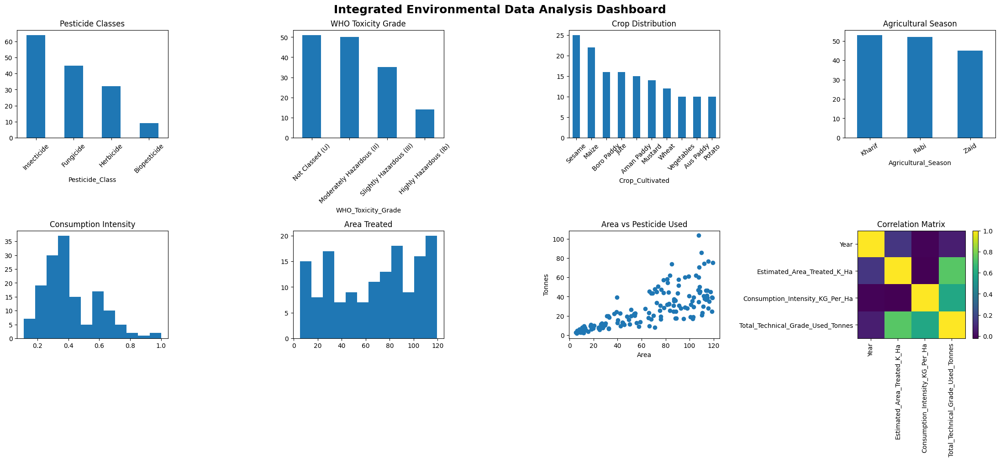

# 🌱 AI-Powered Environmental Data Analyst

## AI Prompt Engineering Workshop – Final Project

**Author:** Jeet Sengupta

---

## 📖 Project Overview

This project demonstrates the application of **Prompt Engineering** and **Artificial Intelligence (AI)** in environmental data analysis.

Using Python, Google Colab, and ChatGPT, a pesticide consumption dataset was analyzed through exploratory data analysis (EDA), statistical visualization, and AI-assisted interpretation. The project illustrates how carefully designed prompts can transform AI into a domain-specific environmental analyst capable of generating structured scientific insights.

---

## 🎯 Objectives

- Import and analyze an environmental dataset.
- Perform Exploratory Data Analysis (EDA).
- Generate descriptive statistics.
- Create an integrated environmental dashboard.
- Apply Prompt Engineering for AI-assisted environmental assessment.
- Demonstrate the role of AI in sustainable agriculture and environmental decision-making.

---

## 🛠 Technologies Used

- Python
- Google Colab
- Pandas
- NumPy
- Matplotlib
- ChatGPT (GPT-5.5)
- GitHub

---

## 📂 Repository Contents

| File | Description |
|------|-------------|
| `AI_Environmental_Data_Analyst.ipynb` | Complete project notebook |
| `west_bengal_pesticide_consumption.csv` | Dataset used for analysis |
| `integrated_environmental_data_analysis_dashboard.png` | Integrated visualization dashboard |
| `README.md` | Project documentation |

---

## 🔄 Workflow

1. Data Loading
2. Data Cleaning
3. Exploratory Data Analysis
4. Statistical Analysis
5. Data Visualization
6. Prompt Engineering
7. AI-Generated Environmental Assessment
8. Conclusions and Recommendations

---

## 📊 Dashboard Preview

*(Display the uploaded dashboard image below.)*

---

## 🚀 Key Features

- Exploratory Data Analysis (EDA)
- Statistical interpretation
- Interactive scientific workflow
- AI-assisted environmental assessment
- Prompt Engineering demonstration
- Data visualization dashboard
- Sustainability-focused recommendations

---

## 📚 Learning Outcomes

- Practical Prompt Engineering
- AI-assisted scientific reporting
- Environmental data interpretation
- Python data analysis
- Data visualization using Matplotlib
- GitHub project management

---

## 📜 License

This repository was developed as part of the **AI Prompt Engineering Workshop** for educational purposes.
